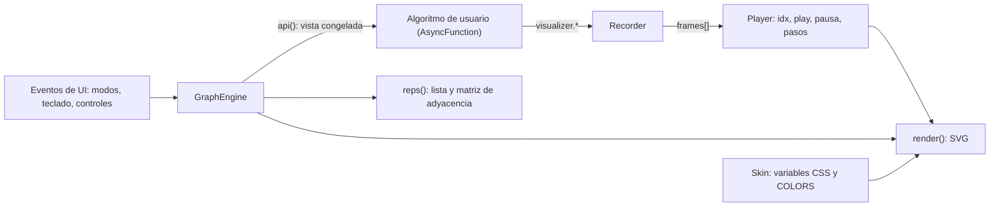
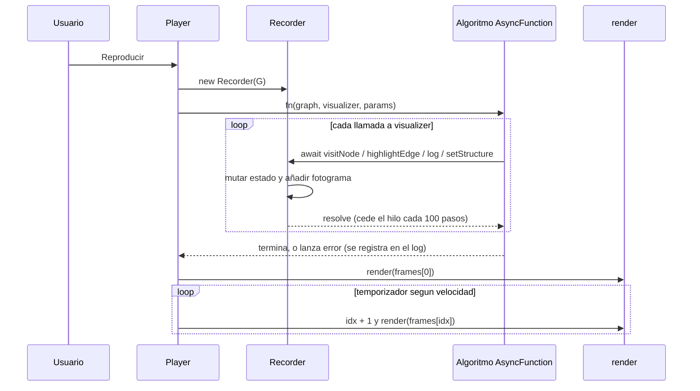

# Graph Lab — Documentación técnica

> Entorno interactivo y motor de visualización de algoritmos de teoría de grafos en tiempo real.
> JavaScript vanilla (ES2017+), SVG y CSS custom properties. Archivo único, sin dependencias de ejecución.

## Índice

1. [Visión general del proyecto](#1-visión-general-del-proyecto)
2. [Arquitectura del sistema](#2-arquitectura-del-sistema)
3. [Referencia de la API del visualizador](#3-referencia-de-la-api-del-visualizador)
4. [Especificación de algoritmos implementados](#4-especificación-de-algoritmos-implementados)
5. [Sistema de temas y personalización (skinning)](#5-sistema-de-temas-y-personalización-skinning)
6. [Manual de instalación, uso y extensiones](#6-manual-de-instalación-uso-y-extensiones)
7. [Referencias](#referencias)

> **Nota de alcance.** Este documento describe la implementación real de `graph-lab.html`. Donde la implementación se aparta de la formulación canónica de un algoritmo o de un patrón (por ejemplo, listas de adyacencia derivadas en vez de persistidas, o complejidades distintas de las de libro), se indica de forma explícita.

---

## 1. Visión general del proyecto

### 1.1 Propósito y problema que resuelve

Los algoritmos de grafos se enseñan casi siempre con pseudocódigo y diagramas estáticos. El estado interno que importa (cola, pila, distancias, conjunto de aristas aceptadas) cambia en cada iteración y el estudiante tiene que reconstruirlo mentalmente. Graph Lab resuelve esto con tres capacidades integradas:

- **Edición directa del grafo**: crear, mover, renombrar y eliminar nodos y aristas; alternar dirigido/no dirigido y ponderado/no ponderado; ver lista y matriz de adyacencia en tiempo real.
- **Ejecución observable**: cada algoritmo se reproduce fotograma a fotograma (play, pausa, paso adelante y atrás, velocidad) con nodos y aristas coloreados por estado, un log textual y las estructuras auxiliares visibles.
- **Extensibilidad**: el usuario escribe o edita algoritmos en un editor integrado contra una API asíncrona pequeña (`visualizer.*`), sin tocar el motor.

Público objetivo: estudiantes y docentes de estructuras de datos y algoritmos, y desarrolladores que quieran prototipar y depurar visualmente un algoritmo de grafos.

**No objetivos.** No hay persistencia, ni layout automático, ni multigrafos ni auto-lazos (`addEdge` los rechaza). Está dimensionado para grafos didácticos (decenas de nodos), no para grafos grandes.

### 1.2 Stack tecnológico

| Capa | Tecnología | Detalle |
|---|---|---|
| Lenguaje | JavaScript ES2017+ | `class`, `async/await`, spread, template literals, `AsyncFunction` |
| Render | SVG (DOM) | Se regenera con `innerHTML` en cada fotograma; coordenadas = píxeles CSS, sin `viewBox` |
| Estilos | CSS custom properties | Tokens `--bg`, `--pn`, `--fg`, `--mu`, `--bd`, `--ed`, `--ac`, `--font`, `--fs`, `--r`, `--sh` |
| Entrada | Pointer Events | `pointerdown/move/up` con `setPointerCapture`, más `contextmenu`, `dblclick` y teclado |
| Persistencia | Ninguna | El estado vive en memoria (`GraphEngine` y el arreglo de fotogramas) |
| Dependencias JS | **Ninguna** | Un solo `.html` (≈28 KB) |
| Recursos externos | Opcional | Hoja de estilos de Google Fonts (`Press Start 2P`, `VT323`) para el tema Pixel Art; si no carga, cae a `monospace` |

Propiedades de diseño que se derivan del stack:

- **Trazabilidad en tiempo de ejecución.** Todo efecto de un algoritmo sobre la visualización es una llamada a `visualizer.*` que queda registrada como un fotograma inmutable. La ejecución es una secuencia de eventos auditable, reproducible y navegable.
- **Compatibilidad con variables CSS.** La apariencia de la UI y del lienzo se controla mediante custom properties y una tabla de colores de estado; cambiar de tema no requiere recargar ni recomputar el algoritmo.
- **Manipulación del DOM SVG acotada.** El render es una función pura de `(grafo, fotograma, skin, selección)`. No hay estado oculto en el DOM, lo que simplifica depurar y razonar sobre la vista.

### 1.3 Organización del archivo

El código está dividido en bloques con cabeceras de comentario, en este orden:

| Bloque | Responsabilidad |
|---|---|
| `GraphEngine` | Modelo del grafo y vista de solo lectura `api()` para los algoritmos |
| `Recorder` | Implementación de `visualizer`; graba fotogramas |
| `ALGS` | Código fuente de los algoritmos predeterminados (cadenas editables) |
| Skins | `BASE`, `SKINS`, `applySkin`, `registerSkin`, `shapeSvg` |
| Estado + Canvas | Estado global de UI, `render()`, `reps()`, `changed()` |
| Edición inline | `edit()` y `editW()` (input flotante para nombre y peso) |
| Modos de edición | `setMode`, manejadores de puntero, atajos de teclado |
| Ejecución + Player | `run()`, `play()`, pasos, velocidad |
| UI | Opciones, editor con resaltado, pestañas, inicialización |

---

## 2. Arquitectura del sistema

### 2.0 Vista de conjunto



Principio rector: **el modelo, la ejecución y la vista están desacoplados**. El algoritmo nunca toca el DOM; solo habla con `visualizer`. La vista nunca ejecuta lógica de algoritmo; solo dibuja un fotograma.

### 2.1 Modelo de datos del grafo

#### Representación interna

`GraphEngine` mantiene una lista de nodos y una lista de aristas:

| Campo | Tipo | Descripción |
|---|---|---|
| `nodes` | `{id, x, y}[]` | `id` es el nombre visible y también el identificador; `x`, `y` en píxeles del lienzo |
| `edges` | `{u, v, w}[]` | Arista de `u` a `v` con peso `w` (por defecto 1) |
| `directed` | `boolean` | Si es `false`, la arista es bidireccional |
| `weighted` | `boolean` | Si es `false`, todos los pesos efectivos valen 1 |

Reglas e invariantes:

- **Identidad por nombre.** Los ids son únicos; `nextName()` asigna `A`–`Z` y luego `N<n>`. `rename(old, new)` rechaza duplicados y actualiza `u`/`v` en todas las aristas.
- **Sin auto-lazos ni duplicados.** `addEdge(u, v)` devuelve `null` si `u === v` o si ya existe una arista con la misma clave.
- **Eliminar un nodo elimina sus aristas incidentes** (`delNode`).
- **Peso efectivo.** `w(e)` devuelve `e.w` si el grafo es ponderado y `1` en caso contrario. El peso almacenado se conserva al alternar el modo, de modo que no se pierde información.
- **Cambio de direccionalidad.** `setOpts(d, w)` actualiza los flags y, si el grafo pasa a no dirigido, **elimina aristas duplicadas** (por ejemplo `A→B` y `B→A` colapsan en una).

#### Clave canónica de arista

Las aristas se identifican en los fotogramas por una clave de texto:

```js
key(u, v) { return this.directed ? u + '>' + v : [u, v].sort().join('-') }
```

En grafos no dirigidos la clave es independiente del orden (`key('A','B') === key('B','A')`), así que `highlightEdge('B','A')` colorea la misma arista que `highlightEdge('A','B')`. En grafos dirigidos la dirección importa y debe coincidir con la almacenada.

> **Limitación.** Si un id contiene `-` o `>`, las claves pueden volverse ambiguas. Evita esos caracteres en nombres de nodo.

#### Listas de adyacencia: derivadas, no persistidas

La estructura almacenada es la lista de aristas. La adyacencia **se deriva bajo demanda**:

```js
neighbors(id) // -> [{ to, weight }]
// recorre G.edges: si e.u === id añade e.v; si no es dirigido y e.v === id añade e.u
```

Consecuencias de diseño:

- Ventaja: no hay estructura redundante que sincronizar; cualquier edición (renombrar, borrar, cambiar dirección) es consistente por construcción.
- Costo: `neighbors(id)` es **O(|E|)** por llamada, no O(grado). Esto afecta la complejidad observada de los algoritmos (ver §4).

#### Vista para algoritmos: `api()`

Los algoritmos reciben un objeto **congelado** (`Object.freeze`) construido a partir del grafo en el momento de ejecutar. Es una instantánea: editar el grafo después no altera una ejecución ya grabada (de hecho, cualquier mutación del grafo invalida los fotogramas; ver §2.2). Ver §3.1 para el contrato.

#### Representaciones derivadas en tiempo real

`reps()` se invoca desde `changed()` y regenera:

- **Lista de adyacencia**: una fila por nodo con `destino(peso)` si el grafo es ponderado.
- **Matriz de adyacencia**: celda `[r][c]` = peso de la arista si existe (en no dirigidos se consulta en ambos sentidos) y `0` si no. En grafos no ponderados la celda vale `1`.

> Una arista de peso `0` es indistinguible de "sin arista" en la matriz. Es una convención de la representación, no un error del modelo.

`reps()` también repuebla los selectores de inicio y destino, conservando la selección previa si el nodo sigue existiendo.

### 2.2 Patrón Grabador–Reproductor (Recorder / Player)

#### Problema

Si el algoritmo manipulara la vista directamente, necesitaría temporizadores internos para "esperar" entre pasos, mezclaría lógica de algoritmo con lógica de presentación, y **no se podría retroceder**: el estado previo ya se habría perdido.

#### Solución: grabar y luego reproducir

1. **Grabación (una sola vez).** `run()` crea un `Recorder`, compila el código del usuario y lo ejecuta hasta el final. Cada llamada a `visualizer.*` actualiza un estado visual acumulado y **añade un fotograma** a `frames[]`. Mientras se graba no se dibuja nada.
2. **Reproducción (tantas veces como se quiera).** El `Player` mantiene un índice `idx` y pide a `render()` que dibuje `frames[idx]`. Avanzar, retroceder, pausar o cambiar la velocidad solo mueve ese índice.

#### Estructura de un fotograma

```js
frame = {
  n:  { [nodeId]: estado },   // estado visual de cada nodo
  e:  { [edgeKey]: estado },  // estado visual de cada arista
  ds: { [nombre]: valor },    // estructuras auxiliares (cola, pila, dist...) copiadas en profundidad
  l:  número                  // cuántas líneas del log son visibles en este fotograma
}
```

- `frames[0]` es el estado inicial (todo sin visitar, log vacío) y **no cuenta** contra el límite de pasos.
- El log se almacena **una sola vez** (`rec.logs`) y cada fotograma guarda solo su longitud `l`; el panel muestra `logs.slice(0, l)`. Así el log es consistente al viajar en el tiempo y no se duplica por fotograma.
- `snap()` copia `n` y `e` superficialmente y `ds` mediante una ida y vuelta por JSON (con `Infinity` mostrado como `∞`), de modo que las estructuras vivas del algoritmo no se filtran a fotogramas pasados.

#### Protocolo del `Recorder`



Cada llamada a la API cuenta como **un paso**:

- `push()` incrementa el contador; si supera **5000** lanza `Error('Límite de 5000 pasos...')`.
- Cada **100** pasos hace `await new Promise(r => setTimeout(r))` para ceder el hilo al navegador.
- Si el algoritmo lanza una excepción (incluido el límite de pasos), `run()` la captura y la registra en el log con el prefijo `❌`; los fotogramas grabados hasta ese punto siguen siendo reproducibles.

#### Máquina de estados del `Player`

| Estado | Variables | Transiciones |
|---|---|---|
| Sin ejecutar | `frames = null` | Reproducir o Paso adelante → `run()` → Listo |
| Listo / pausado | `frames` ≠ null, `playing = false` | Reproducir → Reproduciendo; pasos mueven `idx` |
| Reproduciendo | `playing = true` | Temporizador: `idx++` cada `delay()` ms; al llegar al final vuelve a Listo |
| Invalidado | — | Cualquier cambio estructural vuelve a **Sin ejecutar** |

- **Velocidad.** `delay = 1100 − velocidad × 100` ms, con `velocidad` entre 1 y 10 (de 1000 a 100 ms). Se lee en cada tick, así que cambiarla durante la reproducción tiene efecto inmediato.
- **Controles.** ⏮ lleva a `idx = 0`; ◀ y ▶| mueven un fotograma y pausan; Reproducir/Pausar alterna.
- **Invalidación.** `changed()` (cualquier mutación del grafo), cambiar de algoritmo, inicio o destino, o editar el código descartan `frames`. Mover un nodo **no** invalida: la geometría no forma parte del fotograma, así que la animación se redibuja con las nuevas posiciones.

#### Qué significa "no bloquear el Event Loop" aquí

Conviene ser preciso, porque el patrón evita un problema pero no otro:

- **Lo que sí evita.** La ejecución del algoritmo y el dibujado están separados; no hay `sleep` ni temporizadores dentro del algoritmo, y la reproducción es un temporizador independiente. Durante la grabación el hilo se cede cada 100 pasos, por lo que la UI sigue respondiendo en algoritmos largos.
- **Lo que no evita.** El algoritmo se ejecuta **en el hilo principal**, no en un Worker. Un bucle síncrono que no llame a `visualizer.*` (por ejemplo `while (true) {}`) congela la pestaña. Ver §6.6 para el endurecimiento recomendado.

#### Depuración con viaje en el tiempo (time-travel)

Como cada fotograma es una instantánea completa e inmutable, retroceder es O(1): basta decrementar `idx`. No hace falta deshacer operaciones ni re-ejecutar el algoritmo.

| Aspecto | Valor |
|---|---|
| Acceso aleatorio a cualquier paso | O(1) |
| Memoria | O(F · (V + E + \|ds\|)), con F ≤ 5001 fotogramas |
| Alternativa más compacta | Registro de comandos con operaciones inversas o deltas; cuesta complejidad de implementación |

El render del panel de log reconstruye las líneas visibles en cada fotograma, lo que es O(l) por dibujado. Es irrelevante para los tamaños soportados.

### 2.3 Motor de renderizado vectorial

`render()` es una función pura de `(G, frame, SK, selección, modo, arrastre)` que construye una cadena SVG y la asigna con `innerHTML`. No hay diffing: se redibuja todo en cada cambio, lo cual es suficiente para grafos didácticos y mantiene la lógica trivial de razonar.

#### Sistema de coordenadas

El `<svg>` ocupa todo su contenedor y **no tiene `viewBox`**, así que 1 unidad SVG = 1 px CSS. Las coordenadas del puntero se obtienen con `ev.clientX − svg.getBoundingClientRect().left` (igual para Y). Mover un nodo solo escribe `n.x`, `n.y`.

#### Geometría de aristas

Para una arista de `a` a `b`:

```
d = b − a;  L = |d|;  u = d / L          // vector unitario
p = (−u.y, u.x)                           // normal unitaria
```

- **Aristas antiparalelas.** Si el grafo es dirigido y existe la arista inversa (`b→a`), cada una se desplaza `o = 8` px a lo largo de `p`. Como la normal de `b→a` apunta al lado contrario, las dos líneas quedan separadas y ambas son visibles. Es un **desplazamiento paralelo de segmentos rectos**, no una curva de Bézier.
- **Punta de flecha.** En grafos dirigidos el extremo final se acorta en `R` (radio del nodo, 20 px) para que la punta quede en el borde. Se dibuja un polígono de 13 px de largo y 5 px de semi-ancho en cada lado de `u`.
- **Etiqueta de peso.** En grafos ponderados el texto se coloca en el punto medio, desplazado `p · (1.5·o + 10)` para no solaparse con la línea, con un halo (`paint-order: stroke`) del color de fondo para legibilidad.

#### Estado visual a estilo

Cada elemento obtiene su estado del fotograma (`f.n[id]`, `f.e[key]`) y lo traduce a estilo con `col(estado)`:

```js
const col = s => COLORS[s] || s   // nombre de estado, o cualquier color CSS directo
```

| Elemento | Regla |
|---|---|
| Arista sin estado o `unvisited` | Color `var(--ed)`, grosor `skin.width`, patrón `skin.line` |
| Arista en cualquier otro estado | Color del estado |
| Arista `path` | Grosor `skin.pathWidth` y **sin** patrón de trazo (resalta el resultado) |
| Arista seleccionada | Color `var(--ac)` y grosor +1 |
| Nodo | Relleno `col(estado)`; borde `var(--fg)` si está seleccionado, ámbar si es origen pendiente de arista, `var(--ed)` en otro caso |
| Etiqueta de nodo | `var(--fg)` si `unvisited`; `#04121f` (oscuro fijo) en cualquier otro estado |

> El texto oscuro fijo sobre nodos coloreados asume rellenos claros o saturados. Si defines estados muy oscuros, el nombre del nodo será poco legible.

#### Geometría de nodos adaptativa (`shapeSvg`)

La forma la decide `skin.shape`:

| Forma | Primitiva SVG |
|---|---|
| `circle` (por defecto) | `<circle r=20>` |
| `square` | `<rect>` de 40×40 con `rx=3` |
| `hex` | `<polygon>` de 6 vértices a radio `1.1·R` |
| `pixel` | Polígono de 20 vértices con esquinas escalonadas (2 escalones de 4 px) más una sombra dura desplazada 4 px en x e y (negra, opacidad 0.5) |

Un valor desconocido cae a `circle`. Con `skin.crisp = true` el `<svg>` recibe `shape-rendering="crispEdges"` e `image-rendering: pixelated` para evitar el antialiasing.

#### Detección de impactos (hit-testing)

La interacción no usa eventos por elemento; calcula geometría:

- **Nodo**: distancia al centro ≤ `R` (círculo de 20 px **para todas las formas**, aunque se dibuje cuadrado o hexagonal).
- **Arista**: distancia punto–segmento entre los centros < 9 px. No considera el desplazamiento de aristas antiparalelas; con `o = 8` ambas caen dentro de la tolerancia y el clic selecciona la **primera** que coincida en el arreglo.

### 2.4 Capa de interacción (modos de edición)

Un modo explícito evita las ediciones accidentales:

| Modo | Atajo | `pointerdown` en vacío | Sobre nodo | Sobre arista |
|---|---|---|---|---|
| Mover | `V` | Deselecciona | Selecciona y arrastra | Selecciona |
| Nodo | `N` | **Crea nodo** | — | — |
| Arista | `E` | Cancela origen pendiente | Arrastrar a otro nodo, o clic en origen y luego en destino | — |
| Eliminar | `D` | — | Elimina nodo y sus aristas | Elimina arista |

Detalles:

- **Clic derecho** en dos nodos consecutivos crea una arista en cualquier modo; clic derecho en vacío cancela el origen.
- **Doble clic** renombra un nodo, o edita el peso de una arista en grafos ponderados, mediante un `<input>` flotante (Enter confirma, Esc o perder el foco cancela). Se evita `prompt()` porque puede estar bloqueado en contextos embebidos.
- En grafos ponderados, crear una arista abre de inmediato el editor de peso.
- **Teclado**: `V`, `N`, `E`, `D` cambian de modo; `Supr` o `Retroceso` eliminan la selección. Los atajos se ignoran mientras se escribe en un `<textarea>` o en un `<input>` de texto. Los `<select>` pierden el foco tras un cambio para no capturar los atajos.

### 2.5 Ejecución del código de usuario

El código del editor es el **cuerpo de una función asíncrona** compilada con el constructor `AsyncFunction`:

```js
const AF = Object.getPrototypeOf(async function () {}).constructor;
const fn = new AF('graph', 'visualizer', 'params',
                  'window', 'document', 'fetch', 'localStorage',
                  'globalThis', 'parent', 'top', 'XMLHttpRequest', code);
await fn(G.api(), rec, { start, end });   // los 8 últimos parámetros llegan como undefined
```

Se aplican tres medidas: sombreado de globales comunes, límite de 5000 pasos y cesión periódica del hilo. **No constituye un sandbox de seguridad**; las limitaciones y el endurecimiento se detallan en §6.6.

---

## 3. Referencia de la API del visualizador

El código de usuario dispone de tres identificadores en su ámbito: `graph`, `visualizer` y `params`. Es el cuerpo de una función `async`, por lo que se puede usar `await` y `return` directamente.

### 3.1 Objeto `graph` (solo lectura, congelado)

| Miembro | Tipo | Descripción |
|---|---|---|
| `graph.directed` | `boolean` | `true` si el grafo es dirigido |
| `graph.weighted` | `boolean` | `true` si es ponderado |
| `graph.nodes` | `string[]` | Ids de los nodos, en orden de creación |
| `graph.edges` | `{from, to, weight}[]` | Aristas con el peso efectivo (1 si no es ponderado). En no dirigidos, `from`/`to` conservan el orden de creación |
| `graph.neighbors(id)` | `{to, weight}[]` | Vecinos alcanzables desde `id`. En no dirigidos incluye ambos sentidos; en dirigidos solo aristas salientes. Costo O(\|E\|) |
| `graph.h(a, b)` | `number` | Heurística euclídea escalada entre los nodos `a` y `b`, para A* |

**Heurística `h`.** Se calcula como `dist_euclidea(a, b) × k`, donde `k = min(peso / longitud_en_píxeles)` sobre todas las aristas (0 si no hay aristas). Con este escalado `h` es **admisible y consistente** para cualquier asignación de pesos no negativos: para toda arista `(u,v)`, `h(u) − h(v) ≤ k·|uv| ≤ w(u,v)`. Si los pesos son cero, `k = 0` y A* degenera en Dijkstra.

### 3.2 Objeto `visualizer`

Todos los métodos son `async` y **deben esperarse con `await`**. Cada llamada produce exactamente un fotograma.

| Método | Descripción |
|---|---|
| `await visualizer.visitNode(id, estado = 'visited')` | Asigna el estado visual del nodo `id` |
| `await visualizer.highlightEdge(u, v, estado = 'path')` | Asigna el estado visual de la arista `u`–`v` (la clave sigue las reglas de §2.1) |
| `await visualizer.log(mensaje)` | Añade una línea al log (se convierte con `String()`) |
| `await visualizer.setStructure(nombre, valor)` | Publica una estructura auxiliar en el panel (arreglo, objeto o escalar). Se copia al momento de la llamada; `Infinity` se muestra como `∞` |
| `await visualizer.showPath(ids)` | Marca como `path` los nodos de la ruta y las aristas entre nodos consecutivos, **un fotograma por nodo** (animación progresiva) |

**Estados predefinidos**

| Estado | Significado típico | Color base (tema Moderno) |
|---|---|---|
| `unvisited` | Sin descubrir (en aristas, restablece el estilo por defecto) | `#334155` |
| `queued` | Descubierto, en cola, pila o lista abierta | `#f59e0b` |
| `current` | En proceso en este paso | `#38bdf8` |
| `visited` | Procesado | `#22c55e` |
| `path` | Resultado final (camino o aristas del árbol) | `#a855f7` |

Además se acepta **cualquier color CSS** como estado (`'#ff0000'`, `'tomato'`), o un estado propio registrado en la skin (§5.3).

### 3.3 Objeto `params`

| Campo | Tipo | Descripción |
|---|---|---|
| `params.start` | `string` | Nodo seleccionado en el selector *Inicio* |
| `params.end` | `string` | Nodo seleccionado en el selector *Destino*. Por defecto, el último nodo si hay más de uno |

### 3.4 Contrato y errores

- Usar `await` en cada llamada a `visualizer`; sin él, los fotogramas se graban fuera de orden y las excepciones se pierden.
- No mutar los arreglos devueltos por `graph` esperando efecto en el lienzo: son una instantánea.
- Un algoritmo puede terminar con `return`.
- Una excepción (incluido `Límite de 5000 pasos`) se registra como `❌ <mensaje>` en el log; lo grabado hasta ahí sigue siendo reproducible.

---

## 4. Especificación de algoritmos implementados

Notación: `V` = número de nodos, `E` = número de aristas. Se distinguen dos columnas: la complejidad **canónica** (la del algoritmo con la estructura de datos de libro) y la de **esta implementación**, que prioriza claridad didáctica: `neighbors` es O(E) y las colas con prioridad son arreglos ordenados con `sort`.

### 4.1 Resumen

| Algoritmo | Canónica (tiempo) | Esta implementación (tiempo) | Espacio | Salida visual |
|---|---|---|---|---|
| BFS | O(V + E) | O(V · E) | O(V) | Orden de descubrimiento por niveles |
| DFS | O(V + E) | O(V · E) | O(V) | Orden de profundidad con retroceso |
| Dijkstra | O((V + E) log V) con heap binario | O(E² log E) en el peor caso, más O(V · E) de `neighbors` | O(V + E) | Camino mínimo y distancias |
| A* | Depende de `h`; con `h` consistente cada nodo se expande una vez | Como Dijkstra, más `includes` O(\|abiertos\|) | O(V) | Camino mínimo guiado |
| Prim | O(E log V) con heap | O(V · E) | O(V) | Aristas del MST de la componente de inicio |
| Kruskal | O(E log E) | O(E log E) | O(V + E) | Aristas del MST (bosque si no es conexo) |

> `Array.prototype.sort` en V8 usa TimSort, que se acerca a lineal sobre arreglos casi ordenados, así que en la práctica los costos de ordenar por iteración son menores que el peor caso. Para los tamaños didácticos (decenas de nodos) ninguna de estas diferencias se percibe.

### 4.2 Búsqueda en anchura (BFS)

- **Idea.** Explora por capas: visita todos los vecinos a distancia 1, luego a 2, etc., usando una **cola FIFO**. Calcula distancias mínimas en **número de aristas**.
- **Mecánica.** Encola el inicio (`queued`). Al sacar `u` lo marca `current`, descubre a sus vecinos no vistos (arista y nodo `queued`) y al terminar lo marca `visited`. La estructura `Cola` se publica en cada iteración.
- **Alcance.** Solo la componente alcanzable desde `params.start`. Ignora `params.end` y los pesos.
- **Uso típico.** Camino con menos saltos en grafos no ponderados, niveles de un grafo, prueba de conectividad, bipartición.

### 4.3 Búsqueda en profundidad (DFS)

- **Idea.** Avanza lo más profundo posible por una rama y retrocede al agotarla. Se implementa de forma **recursiva asíncrona**; la estructura `Pila (recursión)` refleja la pila de llamadas.
- **Mecánica.** Al entrar, el nodo pasa a `current`; al bajar por una arista se marca `current`, y al volver `visited`. Al terminar el nodo pasa a `visited`.
- **Advertencia.** La recursión tiene profundidad hasta V; en grafos muy grandes puede desbordar la pila de llamadas. Es irrelevante a escala didáctica.
- **Uso típico.** Detección de ciclos, orden topológico, componentes (fuertemente) conexas, backtracking.

### 4.4 Algoritmo de Dijkstra

- **Idea.** Camino mínimo desde un origen en grafos con **pesos no negativos**. Mantiene `dist[]` y extrae siempre el nodo pendiente con menor distancia; esa distancia ya es definitiva (propiedad voraz).
- **Mecánica.** `dist[inicio] = 0`, el resto `Infinity`. Cola de prioridad como arreglo de pares `[distancia, nodo]` ordenado en cada extracción, con **eliminación perezosa** (si un nodo ya está cerrado, la entrada se descarta). La relajación `d + w < dist[to]` actualiza `dist`, `prev` y encola; la arista y el nodo se marcan `queued`.
- **Parada temprana.** Si hay destino, se detiene al **extraer** `params.end`. Por eso `dist` puede quedar parcial para los demás nodos.
- **Salida.** Reconstruye la ruta con `prev` y la muestra con `showPath`. Publica `dist` y `Cola prioridad`.
- **Restricción.** Con pesos negativos el resultado puede ser incorrecto; no hay verificación.
- **Uso típico.** Ruteo, mapas, redes con costos positivos.

### 4.5 Algoritmo A\*

- **Idea.** Dijkstra guiado por una heurística: ordena por `f(n) = g(n) + h(n)`, donde `g` es el costo acumulado y `h` estima el costo restante hasta el destino.
- **Heurística.** `graph.h` (§3.1): distancia euclídea en píxeles escalada por la mínima razón peso/longitud. Es **admisible** (nunca sobreestima) y **consistente**, por lo que el primer camino que llega al destino es óptimo y no hace falta reabrir nodos cerrados (Hart et al., 1968; Dechter y Pearl, 1985).
- **Mecánica.** Lista `open` ordenada por `f`; conjunto `closed`. Al expandir `u`, relaja a sus vecinos; si mejora `g[to]`, actualiza `f`, `prev` y, si no estaba, lo agrega a `open`. Publica `Abiertos (f)`.
- **Precondición.** Requiere un destino distinto del inicio; si no, registra un mensaje y termina.
- **Uso típico.** Búsqueda de rutas con una noción geométrica de cercanía (mapas, videojuegos). Con `h = 0` equivale a Dijkstra.
- **Observación didáctica.** El mismo grafo en Dijkstra y en A* muestra visualmente cuántos nodos menos se expanden gracias a la heurística, cuando el grafo respeta la geometría del dibujo.

### 4.6 Algoritmo de Prim (árbol de expansión mínima)

- **Idea.** Hace crecer un único árbol desde `params.start`, añadiendo en cada paso la arista de **menor peso que conecta el árbol con un nodo exterior** (propiedad de corte).
- **Mecánica.** En cada iteración recorre todas las aristas y elige la mínima con exactamente un extremo dentro del árbol, de ahí el O(V · E). La arista elegida se marca `path`, el nuevo nodo `visited`, y se publica `Árbol`.
- **Alcance y dirección.** Trata el grafo **como no dirigido** (ignora la orientación). En un grafo no conexo produce el árbol de la componente del inicio, no un bosque.
- **Uso típico.** Diseño de redes de costo mínimo, agrupamiento aglomerativo, grafos densos.

### 4.7 Algoritmo de Kruskal (Union-Find)

- **Idea.** Ordena las aristas por peso y las acepta si **no forman ciclo**, usando una estructura de conjuntos disjuntos (Union-Find).
- **Mecánica.** `p[x]` es el padre de `x`; `find` aplica **compresión de caminos**. Para cada arista se evalúa (`current`); si sus extremos están en conjuntos distintos se unen y la arista pasa a `path`, y si no se descarta restableciendo su estilo (`unvisited`). Publica `Aristas ordenadas`.
- **Unión.** `p[a] = b` sin unión por rango; con solo compresión de caminos el costo amortizado es logarítmico, y el ordenamiento domina: **O(E log E)** (Tarjan, 1975).
- **Alcance y dirección.** Trata el grafo como no dirigido. En un grafo no conexo produce un **bosque de expansión mínima**.
- **Uso típico.** Grafos dispersos, agrupamiento (clustering) por enlace simple, diseño de redes.

### 4.8 Cuándo elegir cada uno

| Necesidad | Algoritmo |
|---|---|
| Menos saltos, sin pesos | BFS |
| Explorar, ciclos, orden de finalización | DFS |
| Camino de costo mínimo, pesos no negativos | Dijkstra |
| Lo mismo con una heurística geométrica | A* |
| Conectar todo al menor costo, grafo denso | Prim |
| Conectar todo al menor costo, grafo disperso o no conexo | Kruskal |

---

## 5. Sistema de temas y personalización (skinning)

Un tema (**skin**) es un objeto JSON plano. `applySkin(cfg)` lo fusiona con `BASE` (tema Moderno), vuelca la paleta en variables CSS y los colores de estado en la tabla `COLORS`, y vuelve a dibujar. No requiere recargar ni recomputar el algoritmo.

### 5.1 Esquema del objeto de skin

| Campo | Tipo | Valores / efecto | Por defecto |
|---|---|---|---|
| `name` | string | Texto de la opción en el selector de temas | `"Moderno"` |
| `font` | string | Valor de `font-family`; se vuelca en `--font` | `system-ui, Segoe UI, sans-serif` |
| `fontSize` | string | Tamaño base, por ejemplo `"10px"`; `--fs` | `14px` |
| `radius` | string | Radio de borde de controles; `--r` | `6px` |
| `shadow` | string | `box-shadow` de botones y barra de modos; `--sh` | ninguna |
| `shape` | string | `circle`, `square`, `hex`, `pixel` | `circle` |
| `line` | string | `solid`, `dashed`, `dotted`, `dither` | `solid` |
| `width` | number | Grosor de arista (px) | `2.5` |
| `pathWidth` | number | Grosor de aristas en estado `path` | `4` |
| `crisp` | boolean | `shape-rendering: crispEdges` e `image-rendering: pixelated` en el lienzo | `false` |
| `scan` | boolean | Superpone *scanlines* a toda la página (`body[data-scan]::after`) | `false` |
| `palette` | objeto | Colores de la UI (ver tabla siguiente) | tokens del tema claro/oscuro del sistema |
| `states` | objeto | Colores de estado de nodos y aristas | ver §3.2 |

**`palette` → variable CSS**

| Clave | Variable | Uso |
|---|---|---|
| `bg` | `--bg` | Fondo de página y lienzo |
| `panel` | `--pn` | Barras, panel lateral, toolbar de modos |
| `text` | `--fg` | Texto y bordes de nodo seleccionado |
| `muted` | `--mu` | Texto secundario |
| `border` | `--bd` | Bordes de controles y paneles |
| `edge` | `--ed` | Aristas sin estado y borde de nodo |
| `accent` | `--ac` | Selección, botón activo, arista seleccionada |

**Reglas de fusión.**

- `states` se fusiona clave por clave con los estados base; las claves omitidas **heredan** del tema Moderno.
- `palette` **no** se fusiona con valores por defecto de skin: las claves omitidas quedan con el valor de `:root`, que depende de `prefers-color-scheme` (claro u oscuro del sistema).
- Antes de aplicar una skin se eliminan las variables que puso la anterior, así que cambiar de tema no deja residuos.

### 5.2 Temas incluidos

**Moderno** (`modern`): círculos, trazo sólido, sin variables inline; sigue el esquema claro/oscuro del sistema (`prefers-color-scheme`, con override por `data-theme`).

**Pixel Art** (`pixel`), estética arcade 8 bits:

```json
{
  "name": "Pixel Art",
  "font": "'Press Start 2P','VT323',monospace",
  "fontSize": "10px",
  "radius": "0px",
  "shadow": "3px 3px 0 #000",
  "shape": "pixel",
  "line": "dither",
  "width": 4,
  "pathWidth": 6,
  "crisp": true,
  "scan": true,
  "palette": {
    "bg": "#0d0221", "panel": "#1a0b3b", "text": "#39ff14", "muted": "#b967ff",
    "border": "#ff2e97", "edge": "#6c4ab6", "accent": "#00f0ff"
  },
  "states": {
    "unvisited": "#2a1a5e", "queued": "#ffd23f", "current": "#00f0ff",
    "visited": "#39ff14", "path": "#ff2e97"
  }
}
```

### 5.3 Skins personalizadas

**Desde la UI.** En la pestaña **Tema** edita el JSON y pulsa *Aplicar tema*. Se registra con el id `custom` (cada aplicación sobrescribe la anterior) y se selecciona en el desplegable. Los errores de JSON se muestran bajo el botón.

**Desde código** (consola o un script propio):

```js
registerSkin('neon', {
  name: 'Neón',
  font: 'monospace',
  shape: 'hex',
  line: 'dashed',
  width: 3,
  pathWidth: 5,
  palette: { bg: '#101820', panel: '#1b2733', text: '#f2f2f2', accent: '#ffb000' },
  states: {
    queued: '#ffb000', current: '#00c2ff', visited: '#2ecc71', path: '#ff5e8a',
    puente: '#ff0000'            // estado propio: visitNode('B', 'puente')
  }
});
```

**Estados propios.** Cualquier clave extra en `states` queda disponible para `visitNode` y `highlightEdge` por su nombre, porque `col()` consulta primero la tabla `COLORS`. Las skins que no definan ese estado lo tratarán como un color CSS literal, así que conviene usar nombres que también sean colores válidos o definirlos en todas las skins que uses.

### 5.4 Cómo añadir una propiedad o forma nueva

- **Forma de nodo**: añade un `case` en `shapeSvg` que devuelva la primitiva SVG; el valor se usa luego como `shape` en el JSON.
- **Estilo de línea**: añade una entrada en la tabla `DASH` (`nombre: 'patrón de stroke-dasharray'`).
- **Propiedad CSS nueva**: añádela a la tabla `PAL` o a la sección que construye `css` en `applySkin`, y úsala en la hoja de estilos con `var(--nombre, valor_por_defecto)`.

---

## 6. Manual de instalación, uso y extensiones

### 6.1 Requisitos

- Un navegador moderno con `async/await`, Pointer Events, `<input>` flotante estándar y `paint-order` en texto SVG (Chrome, Edge, Firefox o Safari recientes).
- Que la página **permita `new Function` / `AsyncFunction`**. Si se sirve con una Content-Security-Policy sin `'unsafe-eval'`, el editor y el lienzo funcionan pero **la ejecución de algoritmos falla**.
- Conexión a internet solo para las fuentes del tema Pixel Art; todo lo demás funciona sin conexión.

### 6.2 Ejecución local

1. Guarda el proyecto como `graph-lab.html`.
2. Ábrelo con doble clic (`file://`) en el navegador, o sírvelo localmente:

   ```bash
   python3 -m http.server 8000
   # abrir http://localhost:8000/graph-lab.html
   ```

No hay paso de compilación ni gestor de paquetes. El botón **Ejemplo** carga un grafo ponderado de 6 nodos para empezar.

### 6.3 Uso de la interfaz

| Control | Función |
|---|---|
| Dirigido / Ponderado | Alterna la naturaleza del grafo (los pesos guardados se conservan) |
| Ejemplo / Limpiar | Carga un grafo de muestra / vacía el lienzo |
| Tema | Cambia de skin en vivo |
| Algoritmo, Inicio, Destino | Elige el algoritmo y los parámetros `params.start/end` |
| ⏮ ◀ ▶ ▶\| | Ir al inicio, paso atrás, reproducir/pausar, paso adelante |
| Velocidad | De 1 (1000 ms por fotograma) a 10 (100 ms) |

| Atajo | Acción |
|---|---|
| `V` · `N` · `E` · `D` | Modo Mover · Nodo · Arista · Eliminar |
| `Supr` / `Retroceso` | Elimina el nodo o arista seleccionado |
| Doble clic | Renombrar nodo / editar peso |
| Clic derecho en dos nodos | Crear arista |

Paneles laterales: **Log** (eventos y estructuras auxiliares del fotograma actual), **Grafo** (lista o matriz de adyacencia), **Código** (editor con resaltado de sintaxis), **Tema** (JSON de skin).

### 6.4 Escribir un algoritmo personalizado

**Flujo.** Elige un algoritmo base en el selector (o parte de cero), edita el código en la pestaña **Código** (el selector pasa a *Personalizado*) y pulsa Reproducir. El texto del editor es el **cuerpo** de la función; no declares `function main() {}` alrededor.

**Plantilla mínima**

```js
// Ámbito disponible: graph, visualizer, params
await visualizer.visitNode(params.start, 'current');
await visualizer.log('Inicio en ' + params.start);
for (const { to, weight } of graph.neighbors(params.start)) {
  await visualizer.highlightEdge(params.start, to, 'queued');
  await visualizer.visitNode(to, 'queued');
}
await visualizer.setStructure('Vecinos', graph.neighbors(params.start).map(v => v.to));
```

**Ejemplo completo: componentes conexas con un color por componente**

```js
// Para grafos no dirigidos. En dirigidos obtiene los nodos alcanzables, no componentes (fuertemente) conexas.
const palette = ['#38bdf8', '#22c55e', '#f59e0b', '#a855f7', '#ef4444'];
const seen = new Set();
let c = 0;
for (const s of graph.nodes) {
  if (seen.has(s)) continue;
  const color = palette[c++ % palette.length];
  const stack = [s];
  seen.add(s);
  await visualizer.log('Componente #' + c + ' desde ' + s);
  while (stack.length) {
    const u = stack.pop();
    await visualizer.visitNode(u, color);              // color CSS directo como estado
    for (const { to } of graph.neighbors(u)) {
      if (seen.has(to)) continue;
      seen.add(to);
      stack.push(to);
      await visualizer.highlightEdge(u, to, color);
    }
  }
}
await visualizer.setStructure('Componentes', c);
```

**Buenas prácticas**

- Usa `await` en **toda** llamada a `visualizer`.
- Granularidad: cada llamada es un fotograma. Agrupa lo que debe verse "a la vez" (por ejemplo, marca primero el nodo y luego la arista solo si el paso visual lo requiere) y evita bucles con miles de llamadas; el límite es **5000 pasos**.
- Publica con `setStructure` lo que un estudiante necesitaría ver (cola, pila, `dist`, conjunto de visitados). Pasar arreglos u objetos copia su contenido en ese instante.
- Usa `log` para narrar decisiones ("Relajar A→B: dist=7"). El log queda sincronizado con el fotograma.
- Valida precondiciones con `return` y un `log` (por ejemplo, exigir `params.end`).
- Respeta la semántica de `neighbors`: en grafos dirigidos devuelve solo aristas salientes.
- Para algoritmos sobre aristas (`graph.edges`) usa `from` y `to` tal cual en `highlightEdge`, para que la clave coincida en grafos dirigidos.

**Depuración.** Los errores aparecen en el log como `❌ mensaje`. Usa ◀ y ▶| para avanzar paso a paso y compara la estructura publicada con tu expectativa; es el equivalente a una depuración con viaje en el tiempo.

### 6.5 Puntos de extensión del proyecto

| Quiero... | Dónde |
|---|---|
| Añadir un algoritmo predeterminado | Nueva entrada en `ALGS` (nombre → código); el selector se construye con `Object.keys(ALGS)` |
| Nueva forma de nodo o estilo de línea | `shapeSvg` / `DASH` (§5.4) |
| Nuevo método de la API | Método `async` en `Recorder` (cada uno debe llamar a `await this.push()` tras mutar el estado) |
| Exponer más datos del grafo | Añadirlos al objeto de `GraphEngine.api()` (se congela) |
| Otro modo de edición | Entrada en `HINTS`, botón en `#tools` y rama en el manejador de `pointerdown` |

### 6.6 Limitaciones conocidas y endurecimiento

**Seguridad del código de usuario (importante).** El constructor de funciones **no** es un sandbox:

- Sombrear `window`, `document`, `fetch`, etc. se puede evadir. Una función sin modo estricto recibe el objeto global como `this`, de modo que `this.fetch`, `self`, `location` u otras referencias no sombreadas siguen siendo accesibles.
- Un bucle síncrono sin llamadas a `visualizer` bloquea el hilo principal.
- No ejecutes código de terceros no confiable en esta versión.

Endurecimiento recomendado, de menor a mayor esfuerzo:

1. Anteponer `'use strict';` al cuerpo y sombrear también `self`, `location`, `opener` y `Function` reduce la superficie, pero no la elimina.
2. Ejecutar el algoritmo en un **Web Worker** (recibe el grafo serializado, devuelve los fotogramas por `postMessage`) con **timeout y `terminate()`**. Resuelve el bloqueo y aísla el DOM.
3. Para aislamiento fuerte, un `<iframe sandbox>` sin `allow-same-origin` con una CSP restrictiva (`default-src 'none'`).

**Otras limitaciones**

| Área | Limitación |
|---|---|
| Rendimiento | Redibujado completo por fotograma; la API del grafo es O(E) por consulta de vecinos; tope de 5000 pasos |
| Identificadores | Ids con `-` o `>` pueden producir claves ambiguas |
| Aristas | Sin multigrafos ni auto-lazos; las antiparalelas se separan con desplazamiento recto, no con curvas |
| Impactos | Hit-test circular (R = 20) para todas las formas; no tiene en cuenta el desplazamiento de aristas antiparalelas |
| Matriz | Peso `0` indistinguible de "sin arista" |
| Accesibilidad | Sin navegación por teclado entre nodos ni atributos ARIA en el SVG |
| Concurrencia | `run()` no está protegido contra reentrada; pulsar Reproducir repetidamente antes de que termine la primera grabación puede lanzar ejecuciones paralelas |
| Persistencia | No se guarda el grafo ni el código entre sesiones |

**Hoja de ruta sugerida:** ejecución en Worker, exportar/importar grafo (JSON), actualización incremental del SVG en lugar de `innerHTML`, listas de adyacencia en caché con invalidación por versión, y camino negativo de pesos con Bellman-Ford como algoritmo adicional.

---

## Referencias

- Cormen, T. H., Leiserson, C. E., Rivest, R. L. y Stein, C. (2022). *Introduction to Algorithms* (4.ª ed.). MIT Press. Capítulos 19 (conjuntos disjuntos), 20 (BFS y DFS), 21 (árboles de expansión mínima: Kruskal y Prim) y 22 (caminos mínimos de origen único: Dijkstra).
- Dijkstra, E. W. (1959). A note on two problems in connexion with graphs. *Numerische Mathematik*, 1(1), 269–271.
- Hart, P. E., Nilsson, N. J. y Raphael, B. (1968). A formal basis for the heuristic determination of minimum cost paths. *IEEE Transactions on Systems Science and Cybernetics*, 4(2), 100–107.
- Dechter, R. y Pearl, J. (1985). Generalized best-first search strategies and the optimality of A\*. *Journal of the ACM*, 32(3), 505–536.
- Prim, R. C. (1957). Shortest connection networks and some generalizations. *Bell System Technical Journal*, 36(6), 1389–1401.
- Kruskal, J. B. (1956). On the shortest spanning subtree of a graph and the traveling salesman problem. *Proceedings of the American Mathematical Society*, 7(1), 48–50.
- Tarjan, R. E. (1972). Depth-first search and linear graph algorithms. *SIAM Journal on Computing*, 1(2), 146–160.
- Tarjan, R. E. (1975). Efficiency of a good but not linear set union algorithm. *Journal of the ACM*, 22(2), 215–225.
- Stasko, J. T. (1990). Tango: A framework and system for algorithm animation. *IEEE Computer*, 23(9), 27–39.
